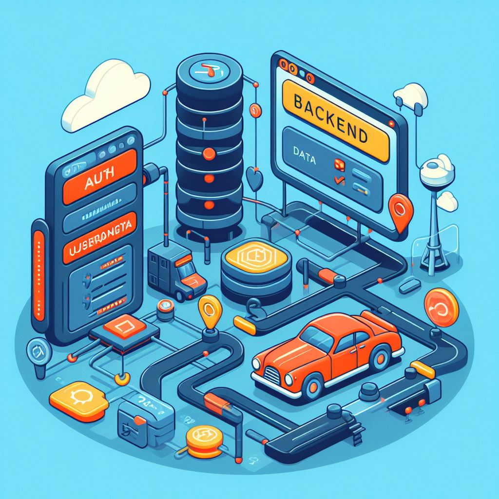

# 🏥 Harkirat's BHospital Project - Cohort 0 - 100 Week 2.5 Assignment 🚀

# 🏥 Harkirat's BHospital Project - Cohort 0 - 100 Week 2.5 Assignment 🚀

<div style="display: flex; justify-content: space-between;">
    
    
</div>
## 🏁 End of Project

<details>
  <summary style="color: #ff0000; font-size: 1.2em; font-weight: bold;">🛑 Important Message</summary>

⚠️ **End of Project**: As of the last commit, this project has reached a significant milestone, marking the completion of major updates and transitions. The decision has been made to conclude major enhancements and focus on maintaining the project in its current state.

🚨 **Project Evolution**: The development journey has seen a transition from an in-memory database to MongoDB, symbolizing a pivotal learning phase. While this is the end of major updates, the project will continue to evolve through minor enhancements, carrying forward the lessons learned during this crucial development period.

</details>


[](https://github.com/Skizzy-create/expressBHospital/blob/main/LICENSE)

🚀 Welcome to the **Bhakti Hospital** - a one-of-a-kind, spiritually-infused, digitally-powered health center! 🏥

This project is a testament to the power of JavaScript, showcasing its versatility in creating a unique health management system. It's not just about physical health but also about spiritual health (bhakti) - because we believe in holistic healing! 💖

Built with **Express.js**, our project provides a robust set of routes to manage users and their health data. From adding new users to updating organ health, our routes have got you covered. And guess what? We've even got a route that calculates a user's maximum health based on a fun mix of physical and spiritual factors! 💪🧘‍♀️

Data validation is a breeze with **Zod**. We've defined schemas for every piece of data we handle, ensuring that everything is in the right format and keeping those pesky bugs at bay. 🐛🚫

Our middleware functions are the unsung heroes, quietly validating users and organs, counting requests, and even selecting operations. They're like the backstage crew that keeps the show running smoothly. 🎭

So, come on in and explore the Bhakti Hospital - where JavaScript, Express.js, and Zod come together to create a health management system like no other! 🎉

## 📂 Project Structure (@needs to be updated@)

```
Backend
│
├── auth
│   └── auth.js
│
├── data
│   ├── data.js
│   └── userData.js
│
├── database.js
│   └── dataBaseFun.js
│
├── routes
│   └── userRoutes.js
│
├── utility
│   ├── constants.js
│   ├── middlewares.js
│   ├── middlewaresDB.js
│   └── schemas.js
│
└── server.js

```

## 🛠️ Installation

1. Clone the repository to your local machine using `git clone https://github.com/Skizzy-create/expressBHospital.git`.
2. Navigate to the project directory.
3. Install the required dependencies with `npm install`.

## 🚀 Usage

1. Start the server using `nodemon server.js`.
2. The server will start running at `https://localhost:3000`.

## 🚦 Routes and Functionalities

### 1. Welcome Route

- **Route:** `GET /`
- **Description:** Welcome route that sends a welcome message.

### 2. Get User Data

- **Route:** `GET /getUser`
- **Description:** Retrieves user data based on the provided `id` query parameter.

### 3. Health Report

- **Route:** `GET /healtReport`
- **Description:** Generates a health report for a user based on the provided `id` query parameter. The health report includes the health points and the percentage of fitness.

### 4. Update Organ Health

- **Route:** `PUT /updateOrgan`
- **Description:** Updates the health status of an organ for a user. Requires `id`, `organ`, and `ishealthy` in the request body.

### 5. Delete Unhealthy Organs

- **Route:** `DELETE /deleteOrgan`
- **Description:** Removes all unhealthy organs for a user based on the provided `id` query parameter.

### 6. Add Organ

- **Route:** `POST /addOrgan`
- **Description:** Adds a new organ (heart or kidney) to a user. Requires `id`, `organ`, and `ishealthy` in the request body.

## 🚦 Authentication Routes (auth.js)

### 1. Sign In

- **Route:** `POST /auth/signin`
- **Description:** Allows users to sign in. Validates user information, creates a JWT token, and saves the user to the MongoDB database.

### 2. Get Users (Authenticated)

- **Route:** `GET /auth/users`
- **Middleware:** `userValidDB`
- **Description:** Retrieves user information for authenticated users. Uses JWT token for authentication.

## 🤝 Contributing

Contributions are welcome. Please fork the repository and create a pull request with your changes.

## 📄 License

This project is licensed under the MIT License.
